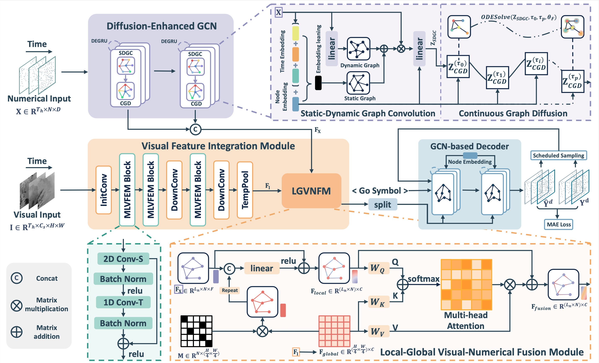

# VN-Net: Unleashing the Potential of Sparse Spatio-Temporal Meteorological Forecasting via Visual-Numerical Fusion in Graph Neural Network

This is the official PyTorch implementation of VN-Net.




## Environment Installation

```bash
pip install -r requirements.txt
```

## Data Preparation

VN-Net uses two types of data: one is the observation data from sparsely distributed ground weather stations (numerical data), and the other is the observation data from meteorological satellites (visual data).

### Numerical Data

The [raw data](https://github.com/bycnfz/weather2k) can be obtained from Weather2K.

We provide the [processed numerical data](https://drive.google.com/drive/folders/13mZpmRd1KckDXNaJWz7hVeHSpXMBCaAq?usp=sharing) of three sub-regions.

### Visual Data
The raw data can be obtained through the FTP server [ftp://hmwr829gr.cr.chiba-u.ac.jp], which is provided by Center for Environmental Remote Sensing (CEReS) of Chiba University, Japan.

If you want to learn more detail of downloading and data processing, the instruction on this [URL](http://quicklooks.cr.chiba-u.ac.jp/~himawari_movie/rd_gridded.html) is maybe useful.

We provide the [processed visual data](https://pan.baidu.com/s/1lL-4yuLTrmzTqzGGqcAIOw?pwd=zwg4) of three sub-regions.


## Training and Evaluation

Taking the temperature prediction for the Northeast region as an example, use the following command to train the model:

```bash
python train.py --config_filename configs/mlvfem_degcn_lgvnfm/d60_temp.yaml
```

The train epoch is set to 100 and the early-stopping epoch is set to 15.
After the training is completed, the MAE and RMSE metrics will be automatically evaluated and saved in the log file.
